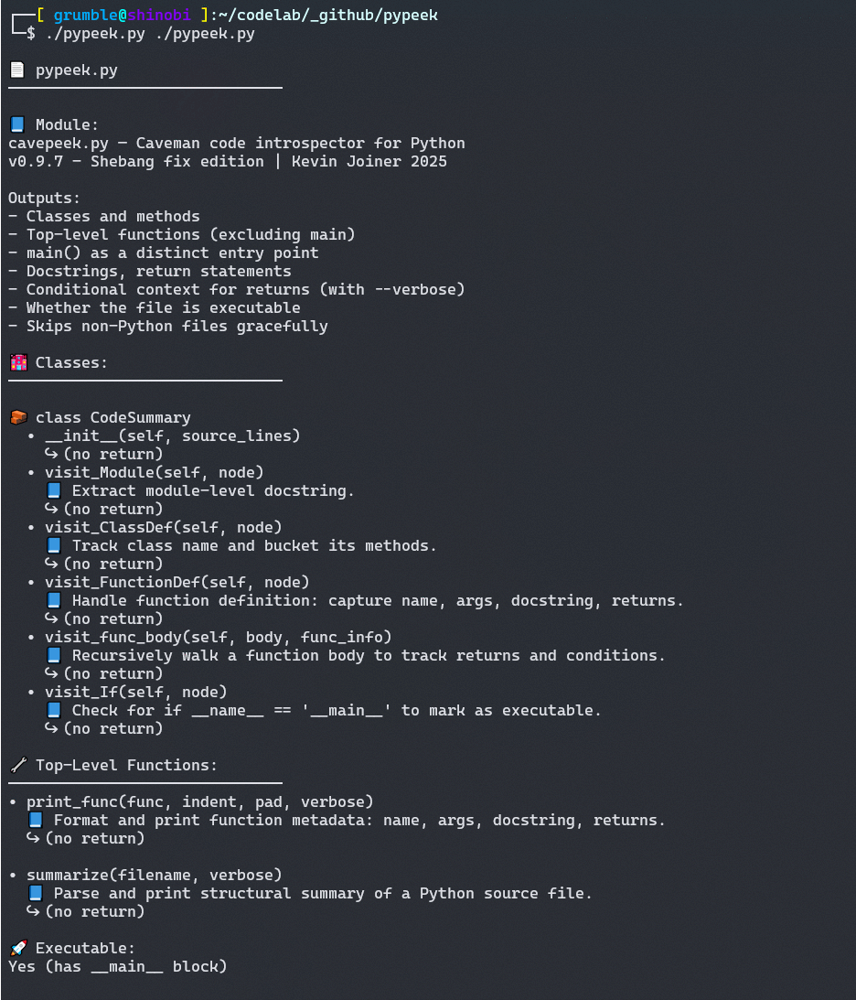

# pypeek

Python code structure introspector — lists classes, functions, docstrings, entry points, return paths, and more.



## Features

- Lists classes and methods
- Shows top-level functions (excluding main)
- Highlights main() as entry point
- Prints docstrings and return statements
- Shows whether file is executable (`__main__` block)
- Skips non-Python files
- Optional verbose mode for conditionals


## Inspiration 

I was frustrated trying to get a simple, structured view of some of my larger Python projects—something that would show input, output, classes, functions, and more at a glance.

So I created this tool (originally called “cavepeek,” since it felt like a caveman approach!). But it’s proven extremely useful, so I’m sharing it in case it helps you too.

## Usage

```bash
python3 pypeek.py some_script.py [--verbose]
```

## Requirements

- Python 3 (3.7+ recommended)
- No venv, no pip install—just one script!
- Tested with python 3 on mac and linux


